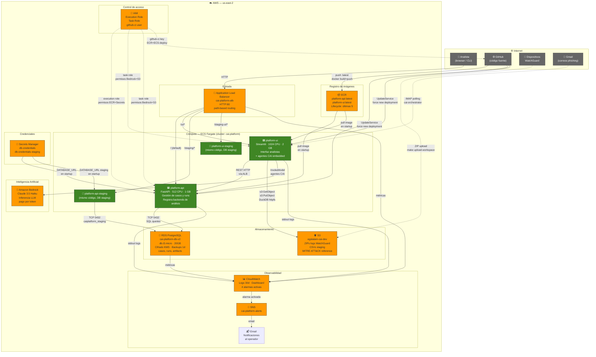

# Arquitectura de nube — CAI Platform

---

## Parte 1: Documentación técnica

### Visión general

CAI Platform es un sistema de análisis de seguridad asistido por inteligencia artificial. Recibe logs de dispositivos de red (WatchGuard), correos de phishing o datos de ataques DDoS, los procesa mediante agentes de IA (Claude vía Amazon Bedrock), y produce reportes de investigación. La plataforma corre íntegramente en AWS sobre la región `us-east-2` (Ohio).

---

### Servicios AWS involucrados

#### 1. Application Load Balancer (ALB) — `cai-platform-alb`

**Rol:** punto de entrada único a la plataforma. Recibe todo el tráfico externo en HTTP:80 y lo enruta a los servicios correctos según el path de la URL.

**Routing rules (por prioridad):**
| Prioridad | Path | Destino |
|---|---|---|
| 10 | `/ui`, `/ui/*` | platform-ui prod (puerto 8501) |
| 20 | `/staging`, `/staging/*` | platform-api staging (puerto 8000) |
| 30 | `/staging-ui`, `/staging-ui/*` | platform-ui staging (puerto 8501) |
| default | todo lo demás | platform-api prod (puerto 8000) |

**Configuración:** internet-facing, esquema público, subnets del VPC default. Sin HTTPS por ahora (pendiente para producción con clientes reales).

**Health checks:**
- `platform-api`: `GET /health` → `{"status": "ok"}`
- `platform-ui`: `GET /_stcore/health` (endpoint interno de Streamlit)

---

#### 2. ECS Fargate — cluster `cai-platform`

**Rol:** motor de cómputo serverless. Corre los contenedores Docker sin necesidad de gestionar servidores EC2.

Hay cuatro servicios ECS en el cluster:

##### `platform-api` (producción)
- **Task definition:** `cai-platform-api:3`
- **Recursos:** 512 vCPU units, 1024 MB RAM
- **Imagen:** `942454901447.dkr.ecr.us-east-2.amazonaws.com/cai-platform/platform-api:latest`
- **Qué hace:** servidor HTTP FastAPI. Expone las rutas REST que gestionan casos (`/cases`), runs (`/runs`), artefactos (`/artifacts`) y observaciones. Registra en proceso los dos backends de análisis (`watchguard_logs` y `phishing_email`). Persiste el estado en RDS PostgreSQL. No hace llamadas a IA directamente — eso lo hace el orchestrator desde fuera o desde platform-ui.
- **Variables de entorno:** `PLATFORM_API_HOST`, `PLATFORM_API_PORT`
- **Secretos inyectados:** `DATABASE_URL` desde Secrets Manager en tiempo de arranque

##### `platform-ui` (producción)
- **Task definition:** `cai-platform-ui:1`
- **Recursos:** 1024 vCPU units, 2048 MB RAM (Streamlit + agentes CAI requieren más)
- **Imagen:** `942454901447.dkr.ecr.us-east-2.amazonaws.com/cai-platform/platform-ui:latest`
- **Qué hace:** interfaz web Streamlit para analistas. Envuelve el `cai-orchestrator` (que a su vez contiene los agentes CAI). Permite al analista cargar payloads, lanzar investigaciones, monitorear correos IMAP y ver resultados. Se comunica con `platform-api` vía HTTP y con Amazon Bedrock para la inferencia de los agentes.
- **Variables de entorno:** `PLATFORM_API_BASE_URL`, `CAI_MODEL`, `WATCHGUARD_S3_BUCKET`, `WATCHGUARD_S3_REGION`
- **AWS credentials:** no se inyectan explícitamente — usa el IAM Task Role vía IMDS (Instance Metadata Service)

##### `platform-api-staging` y `platform-ui-staging`
- Mismas imágenes que producción, apuntando a la base de datos `caiplatform_staging`
- Desired count = 0 en reposo; el CI/CD los levanta en cada push a `main`
- Accesibles via ALB en paths `/staging/*` y `/staging-ui/*`

---

#### 3. Amazon ECR — Elastic Container Registry

**Rol:** registro privado de imágenes Docker. Almacena las imágenes construidas por el CI/CD.

**Repositorios:**
- `cai-platform/platform-api` — imagen de la API FastAPI
- `cai-platform/platform-ui` — imagen de la UI Streamlit + orchestrator

**Lifecycle policies (ambos repos):**
- Imágenes sin tag: expiran en 1 día
- Imágenes tagged (`v*`, `latest`): se retienen las últimas 5; el resto expira automáticamente

---

#### 4. RDS PostgreSQL — `cai-platform-db-v2`

**Rol:** base de datos relacional. Es el único estado persistente de la plataforma API.

**Configuración:**
- Engine: PostgreSQL 16
- Instance class: `db.t3.micro`, 20 GB
- **Cifrado en reposo:** sí (KMS `alias/aws/rds`)
- **Backups automáticos:** 1 día de retención (límite free tier)
- Publicly accessible: **no** — solo accesible desde dentro del VPC
- Subnet group: `cai-platform-rds-subnet-group` (us-east-2a, 2b, 2c)

**Bases de datos:**
- `caiplatform` — producción
- `caiplatform_staging` — staging

**Qué almacena:** casos de investigación (`cases`), runs de análisis (`runs`), artefactos de datos (`artifacts`). El esquema usa JSONB para flexibilidad sin migraciones. No hay FK a nivel de BD — la integridad la garantiza `platform-core`.

**Credenciales:** gestionadas en AWS Secrets Manager. La task definition de ECS inyecta `DATABASE_URL` en el contenedor desde el secreto, sin que la contraseña aparezca en logs ni en la consola de ECS.

---

#### 5. AWS Secrets Manager

**Rol:** almacén seguro de credenciales. Evita que contraseñas aparezcan en código, variables de entorno hardcodeadas o task definitions en texto plano.

**Secretos activos:**
| Nombre | Contenido | Usado por |
|---|---|---|
| `cai-platform/db-credentials` | username, password, host, port, dbname, DATABASE_URL | ECS platform-api (prod) |
| `cai-platform/db-credentials-staging` | Igual pero apuntando a caiplatform_staging | ECS platform-api-staging |

ECS los consume en tiempo de arranque del contenedor vía la directiva `secrets:` en la task definition, usando el execution role.

---

#### 6. Amazon S3 — bucket `egslatam-cai-dev`

**Rol:** almacenamiento de objetos para archivos grandes. Es donde viven los logs de WatchGuard y los datos de referencia de MITRE ATT&CK.

**Estructura del bucket:**
```
egslatam-cai-dev/
├── reference/
│   └── mitre/
│       ├── enterprise-attack.json        (43 MB — base de conocimiento MITRE)
│       └── enterprise_techniques.json    (2.2 MB — técnicas procesadas)
└── workspaces/
    └── {workspace_id}/
        ├── input/
        │   └── uploads/{upload_id}/
        │       └── raw.zip               (ZIP con logs WatchGuard originales)
        └── staging/
            └── {staging_id}/
                ├── traffic/{fecha}/      (CSVs de tráfico descomprimidos)
                ├── alarm/{fecha}/        (CSVs de alarmas)
                └── event/{fecha}/        (CSVs de eventos)
```

**Acceso:** el orchestrator/platform-ui descarga el ZIP desde S3, lo descomprime en staging, y luego DuckDB consulta los CSVs directamente desde S3 vía la extensión `httpfs` (sin descargar localmente).

**Lifecycle policy:** objetos con tag `lifecycle=staging` expiran automáticamente a los 14 días. El código de staging aplica este tag en cada `put_object`. Los ZIPs de input y los datos de referencia no tienen el tag, por lo que no expiran.

**Seguridad:** public access completamente bloqueado. Sin bucket policy pública. Acceso solo mediante IAM roles.

---

#### 7. Amazon Bedrock

**Rol:** inferencia de modelos de lenguaje (LLM). Es el motor de IA que potencia los agentes de análisis.

**Modelo activo:** `us.anthropic.claude-3-5-haiku-20241022-v1:0` (Claude 3.5 Haiku via cross-region inference)

**Cómo se usa:** el `cai-orchestrator` (embebido en `platform-ui`) construye agentes CAI que invocan Bedrock mediante `bedrock:InvokeModel` y `bedrock:InvokeModelWithResponseStream`. Cada investigación genera múltiples llamadas al modelo — para análisis de observaciones, generación de hipótesis y producción del reporte final.

**Acceso:** el ECS Task Role tiene permiso explícito `bedrock:InvokeModel*` sobre `Resource: *`. En entorno local, las credenciales del `.env` se usan directamente.

**Costo:** pago por token consumido, sin costo fijo. No hay reserva ni endpoint dedicado.

---

#### 8. AWS IAM — Identity and Access Management

**Rol:** control de acceso. Define qué entidades pueden hacer qué en AWS.

**Roles activos:**

**`cai-platform-ecs-execution-role`** — usado por ECS para arrancar los contenedores:
- `AmazonECSTaskExecutionRolePolicy` — pull de imágenes desde ECR, escritura de logs en CloudWatch
- `SecretsManagerReadWrite` — leer secretos durante el arranque del contenedor

**`cai-platform-ecs-task-role`** — usado por el código corriendo dentro de los contenedores:
- `bedrock:InvokeModel`, `bedrock:InvokeModelWithResponseStream` — llamadas a Claude
- `s3:GetObject`, `s3:PutObject`, `s3:ListBucket`, `s3:DeleteObject` en `egslatam-cai-dev`

**Usuario `github-ci`** — usado por GitHub Actions:
- ECR: push/pull de imágenes en los repos del proyecto
- ECS: `UpdateService`, `RegisterTaskDefinition`, `DescribeServices`
- IAM: `PassRole` solo para los roles de ejecución/tarea del proyecto

---

#### 9. Amazon CloudWatch

**Rol:** observabilidad centralizada. Recolecta logs, métricas y gestiona alarmas.

**Log groups:**
- `/ecs/cai-platform-api` — logs de todos los contenedores (stream prefix por servicio). Retención: 30 días.

**Dashboard:** `cai-platform` con widgets en tiempo real:
- ECS: running tasks count, CPU utilization, memory utilization
- ALB: request count, response time p99, HTTP 4xx/5xx errors
- RDS: CPU utilization, free storage space, database connections
- Panel de estado de todas las alarmas

**Alarmas configuradas:**
| Alarma | Métrica | Umbral | Período |
|---|---|---|---|
| `cai-api-task-down` | ECS RunningTaskCount | < 1 | 2 min |
| `cai-alb-5xx-high` | ALB HTTPCode_Target_5XX_Count | > 10 | 5 min |
| `cai-rds-cpu-high` | RDS CPUUtilization | > 80% | 10 min |
| `cai-rds-storage-low` | RDS FreeStorageSpace | < 2 GB | 5 min |

---

#### 10. Amazon SNS — Simple Notification Service

**Rol:** sistema de notificaciones. Recibe disparos de CloudWatch y los distribuye a los suscriptores.

**Topic:** `cai-platform-alerts`
**Suscriptores:** email `sebastianreyesalarcon21@gmail.com` (requiere confirmación inicial vía email de AWS)

Cuando una alarma se activa o se recupera, SNS envía un email con el detalle de la métrica, el umbral superado y el período de evaluación.

---

### Flujos de comunicación

#### Flujo 1: Analista lanza una investigación WatchGuard
```
Analista → ALB (/ui/*) → platform-ui (ECS)
    → platform-ui llama platform-api (ALB /)
        → platform-api crea case/run en RDS
    → platform-ui descarga ZIP desde S3
    → platform-ui descomprime y escribe CSVs en S3 (staging)
    → platform-ui lanza agentes CAI
        → agentes consultan CSVs en S3 vía DuckDB/httpfs
        → agentes invocan Bedrock (Claude) para análisis
        → agentes registran observaciones en platform-api → RDS
    → platform-ui genera reporte HTML/PDF
```

#### Flujo 2: Deploy de nueva versión (CI/CD)
```
Developer hace push a main en GitHub
    → GitHub Actions ejecuta workflow deploy.yml
        → Job test: instala dependencias, corre pytest
        → Job build-api: docker build → push ECR (platform-api:sha, :latest)
        → Job build-ui: docker build → push ECR (platform-ui:sha, :latest)
        → Job deploy-staging:
            → ECS UpdateService platform-api-staging (desired=1, force new deployment)
            → ECS UpdateService platform-ui-staging (desired=1, force new deployment)
            → Smoke test: curl ALB/staging/health → 200
        → Job deploy-prod (solo en releases/tags):
            → ECS UpdateService platform-api (force new deployment)
            → ECS UpdateService platform-ui (desired=1)
            → Smoke test: curl ALB/health → 200
```

#### Flujo 3: Arranque de un contenedor ECS
```
ECS Scheduler decide lanzar una nueva task
    → Execution role autentica contra ECR → pull de imagen Docker
    → Execution role llama Secrets Manager → obtiene DATABASE_URL
    → Contenedor arranca con DATABASE_URL en sus variables de entorno
    → Contenedor conecta a RDS PostgreSQL
    → Health check pasa → ALB registra el target como healthy
    → ECS da por completado el deployment
```

#### Flujo 4: Alarma operacional
```
ECS task se cae (crash, OOM, etc.)
    → CloudWatch detecta RunningTaskCount < 1 durante 2 minutos
    → Alarma cai-api-task-down se activa
    → SNS topic recibe el evento
    → Email llega a sebastianreyesalarcon21@gmail.com con detalle
(En paralelo, ECS intenta automáticamente levantar una nueva task)
```

---

### Red y VPC

Toda la infraestructura corre en el VPC default de la cuenta (`vpc-0af56f8f93bcb4636`, CIDR `172.31.0.0/16`). No hay VPC dedicada ni subnets privadas — esto es aceptable para la fase actual pero es una mejora recomendada para producción con clientes.

Los contenedores ECS tienen IPs públicas asignadas (`assignPublicIp: ENABLED`) para poder salir a internet (pull de paquetes Python, llamadas a Bedrock). RDS no es públicamente accesible — solo acepta conexiones desde dentro del VPC.

---

## Parte 2: Diagrama y explicación

### Diagrama de arquitectura



---

### Explicación para personas no técnicas

Imagina que CAI Platform es una **oficina de investigadores de seguridad que trabajan 24/7 en la nube**. A continuación te explicamos qué hace cada parte, como si fuera un edificio con distintos departamentos.

---

#### La puerta de entrada — ALB (Application Load Balancer)

Cuando un analista abre el navegador para usar la plataforma, lo primero que encuentra es el **balanceador de carga**, que funciona como la **recepcionista del edificio**. Su trabajo es recibir a todos los visitantes y dirigirlos al departamento correcto según a dónde quieren ir:

- Si el analista quiere usar la **interfaz visual** (la pantalla con botones y formularios), la recepcionista lo manda al piso de la interfaz de usuario.
- Si el analista quiere **consultar datos directamente** (como un programador), lo manda al piso de la API.
- Si es alguien probando cosas en el entorno de pruebas, lo manda a los pisos de staging.

La recepcionista también sabe cuándo un departamento está fuera de servicio y deja de mandar gente ahí hasta que se recupere.

---

#### Los departamentos principales — ECS Fargate (platform-api y platform-ui)

Dentro del edificio hay dos departamentos clave que siempre están funcionando:

**El departamento de datos (platform-api)** es como la **sala de archivos y administración**. No tiene cara visible para el analista, pero es el corazón del sistema. Recibe instrucciones del resto de la plataforma, guarda el registro de cada investigación que se abre, sus resultados y todos los datos asociados. Sin él, no habría memoria de lo que pasó en cada caso.

**El departamento de atención al analista (platform-ui)** es la **sala de operaciones donde trabajan los investigadores**. Tiene una pantalla con menús, formularios y botones. Desde ahí el analista puede:
- Cargar los logs de un dispositivo de red para analizarlos
- Lanzar una investigación de un correo de phishing
- Ver el estado de investigaciones en curso
- Leer los reportes generados por la IA

---

#### La biblioteca y el archivo — S3 y RDS

**S3 (la bodega de archivos grandes)** es como un **depósito de almacenamiento**. Ahí se guardan los archivos enormes: los registros de tráfico de red de los clientes (que pueden pesar cientos de megabytes), los datos de referencia sobre técnicas de ataque conocidas (el catálogo MITRE ATT&CK), y los archivos procesados listos para análisis. Es como tener un depósito de cajas de documentos que la plataforma puede ir a buscar cuando necesita analizar algo.

**RDS (la base de datos)** es como el **libro de casos de la oficina**. Guarda la información estructurada: qué investigaciones se abrieron, cuándo, qué resultados tuvieron, qué artefactos se recolectaron. Es mucho más organizado que la bodega — es donde se busca rápido. Además, toda la información está **cifrada bajo llave** (como una caja fuerte) para que nadie pueda acceder a ella sin los permisos correctos.

---

#### El investigador con IA — Amazon Bedrock (Claude)

Cuando el analista lanza una investigación, los agentes de la plataforma necesitan **pensar**. Para eso usan **Amazon Bedrock**, que es como tener un consultor experto en seguridad siempre disponible al teléfono. Este consultor es en realidad un modelo de inteligencia artificial (Claude 3.5 Haiku de Anthropic) que puede leer miles de líneas de logs, identificar patrones sospechosos, relacionar comportamientos con técnicas de ataque conocidas y redactar un reporte explicando sus hallazgos.

La plataforma le hace preguntas al modelo y él responde. Cada investigación puede generar decenas de preguntas y respuestas. Se paga solo por lo que se usa, como un taxi — no hay costo fijo.

---

#### La caja fuerte de contraseñas — Secrets Manager

Cada departamento necesita contraseñas para conectarse entre sí (por ejemplo, la API necesita la contraseña de la base de datos). En lugar de anotar esas contraseñas en papeles visibles para todos, la plataforma usa un **gestor de contraseñas seguro** (Secrets Manager). Cuando un departamento arranca por primera vez, va a la caja fuerte, se identifica, y recibe la contraseña que necesita. Nadie más puede verla.

---

#### El almacén de versiones del software — ECR

Cuando los desarrolladores mejoran la plataforma, crean una nueva "versión" del software empaquetada en un contenedor (como una nueva edición de un libro). **ECR** es la **librería o bodega de ediciones** donde se guardan esas versiones. El sistema de actualización automática va ahí a buscar la versión más reciente cada vez que hay un deploy. Las versiones viejas se eliminan automáticamente para no acumular copias innecesarias.

---

#### El sistema de actualizaciones automáticas — GitHub Actions (CI/CD)

Cuando un desarrollador termina una mejora y la sube al repositorio de código (GitHub), **automáticamente se pone en marcha una cadena de trabajo**:

1. Se corren todas las pruebas automáticas para verificar que nada está roto
2. Se construye la nueva versión del software
3. Se sube al almacén de versiones (ECR)
4. Se despliega en el entorno de pruebas (staging) primero
5. Se verifica que el entorno de pruebas responde correctamente
6. Solo cuando hay una versión oficial etiquetada, se despliega en producción

Es como un **proceso de control de calidad automatizado** que asegura que nada malo llega a los analistas sin haber sido probado antes.

---

#### El panel de control — CloudWatch, SNS y el email de alertas

Para saber si todo funciona bien sin tener que mirar la pantalla constantemente, la plataforma tiene un **sistema de vigilancia automática**:

- **CloudWatch** es como el **panel de instrumentos de un avión**: muestra en tiempo real cuántos investigadores virtuales están trabajando, qué tan ocupados están los servidores, cuánto espacio queda en la base de datos, y cuántos errores están ocurriendo.

- Cuando algo sale mal (la API se cae, la base de datos llega al 80% de CPU, queda poco espacio en disco), **CloudWatch activa una alarma** que le avisa al sistema de notificaciones (**SNS**), que a su vez **envía un email al operador** del sistema. Es como la alarma de un edificio que alerta al guardia de seguridad.

- Todos los mensajes que generan los programas (logs) se guardan durante 30 días para poder investigar qué pasó en caso de un problema.

---

#### El guardia de seguridad — IAM

No todos en el edificio pueden entrar a todos los cuartos. **IAM** es el sistema de **tarjetas de acceso y permisos**. Define que:

- El sistema que levanta los contenedores puede ir al almacén de imágenes (ECR) y a la caja fuerte de contraseñas (Secrets Manager), pero no puede hacer nada más.
- Los programas que corren dentro de los contenedores pueden usar la IA (Bedrock) y acceder a la bodega de archivos (S3), pero no pueden tocar la facturación ni crear nuevos servidores.
- El robot de actualizaciones automáticas (GitHub Actions) puede subir imágenes y decirle a ECS que se actualice, pero no puede tocar la base de datos ni los secretos.

Cada entidad tiene exactamente los permisos que necesita y nada más.

---

#### El entorno de pruebas — Staging

Antes de que cualquier cambio llegue a los analistas reales, existe un **entorno de pruebas paralelo** (staging) que es una copia casi idéntica de todo el sistema pero con una base de datos separada. Los desarrolladores pueden probar ahí libremente sin riesgo de afectar las investigaciones reales. El robot de actualizaciones siempre despliega primero en staging, verifica que funciona, y solo entonces toca producción.

---

#### En resumen

La plataforma CAI es una oficina de investigación de seguridad completamente automatizada en la nube. Los analistas entran por la puerta (ALB), trabajan en la sala de operaciones (platform-ui), que se apoya en el departamento de administración (platform-api), la bodega (S3), el libro de casos (RDS) y el consultor IA (Bedrock). Todo está vigilado 24/7 (CloudWatch), con alarmas automáticas (SNS), actualizaciones sin intervención manual (GitHub Actions), contraseñas en caja fuerte (Secrets Manager) y control de acceso granular (IAM). Si algo falla, el sistema se recupera solo y avisa al operador por email.
