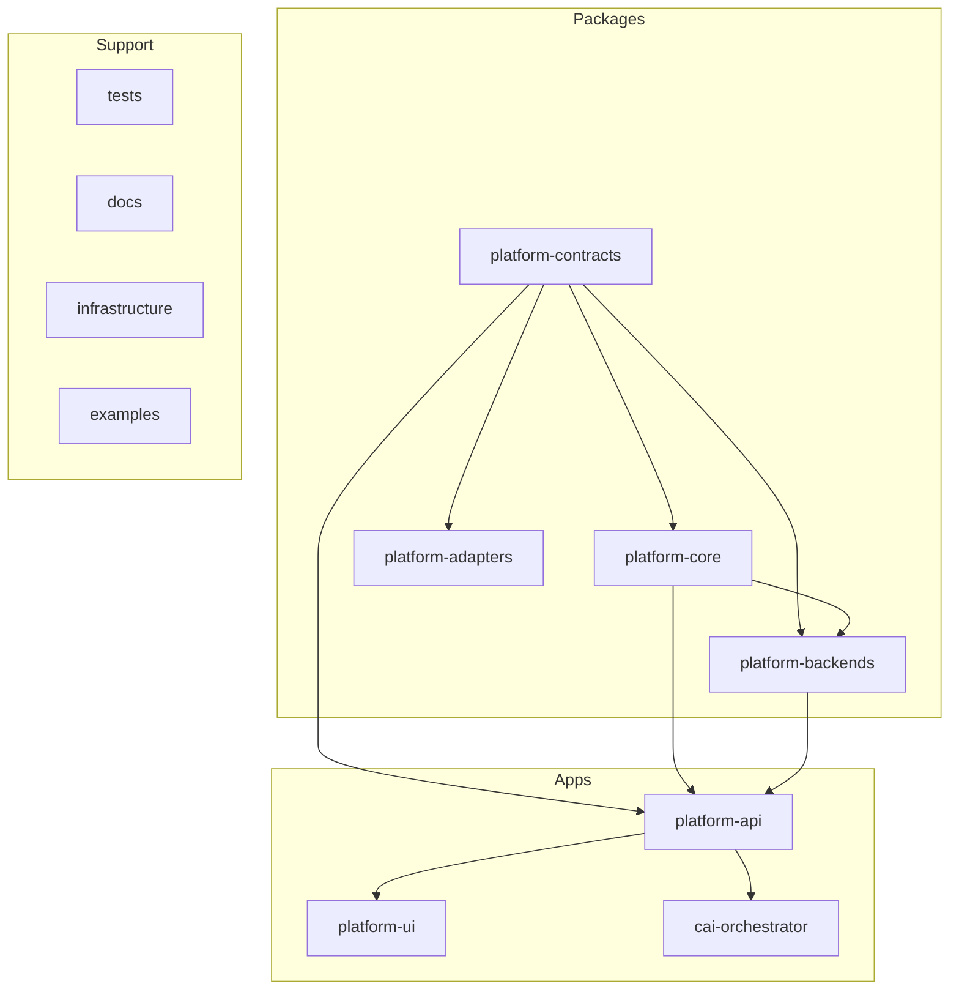
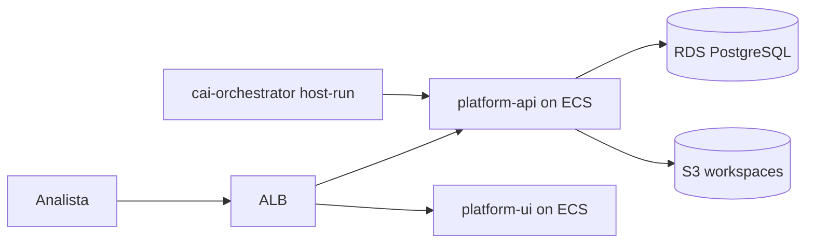

# Mapa del repositorio cai-platform (referencia experta)

Este documento resume la estructura real del repositorio, con énfasis en el despliegue actual en AWS y en cómo se conectan las capas de código.

## 1. Visión general

`cai-platform` es un monorepo Python para investigación de ciberseguridad. La plataforma expone un API determinista, una UI Streamlit y un orquestador host-run para agentes CAI.

- Fuente de verdad documental: [docs/README.md](../README.md)
- Operación y despliegue: [docs/operations/README.md](../operations/README.md) y [docs/operations/deploy-aws.md](../operations/deploy-aws.md)

## 2. Estructura del repositorio

| Área | Ubicación | Rol |
|---|---|---|
| Contratos | `packages/platform-contracts/` | Schemas Pydantic compartidos: casos, artifacts, runs, observaciones, queries y aprobaciones. |
| Core | `packages/platform-core/` | Servicios de coordinación, audit trail, approvals y puertos de persistencia. |
| Adapters | `packages/platform-adapters/` | Normalización de WatchGuard y phishing email. |
| Backends | `packages/platform-backends/` | Lógica determinista de `watchguard_logs` y `phishing_email`. |
| API | `apps/platform-api/` | FastAPI, runtime in-memory o PostgreSQL según `DATABASE_URL`, y exposición HTTP de observaciones/queries. |
| UI | `apps/platform-ui/` | Streamlit para investigaciones WatchGuard, phishing e IMAP. |
| Orquestador | `apps/cai-orchestrator/` | CLI host-run, agentes CAI, pipeline DDoS e informes offline. |
| Infra | `infrastructure/terraform/` | ECS, ALB, RDS, S3, ECR, IAM y monitoreo en AWS. |
| Tests | `tests/` | Cobertura por boundary: `contracts/`, `core/`, `adapters/`, `backends/`, `apps/`. |

## 3. Topología de ejecución

### Producción

- El cluster ECS se crea con `name_prefix`, que en `prod` hoy es `cai-platform`.
- `platform-api` recibe `DATABASE_URL` desde Secrets Manager.
- `platform-ui` consume `PLATFORM_API_BASE_URL` apuntando al ALB.

### Desarrollo local

- `compose.yml` levanta `platform-api` y `platform-ui`.
- `make api-dev` corre solo el API local.
- Si `DATABASE_URL` no está definida, el runtime usa repositorios in-memory.

## 4. Stack tecnológico

| Capa | Tecnología |
|---|---|
| Lenguaje | Python 3.12+ |
| Empaquetado | setuptools con layout `src/` |
| API HTTP | FastAPI + uvicorn |
| UI | Streamlit |
| Cliente HTTP | httpx |
| Contratos | Pydantic 2 |
| Persistencia | PostgreSQL en prod / in-memory en dev y tests |
| Infra | AWS ECS Fargate, ALB, RDS, S3, ECR, Secrets Manager, CloudWatch |
| CAI | Dependencia opcional `cai-framework` en `apps/cai-orchestrator[cai]` |

## 5. Entradas principales

### `platform-api`

- Entrada: `apps/platform-api/src/platform_api/app.py`
- Runtime: `apps/platform-api/src/platform_api/runtime/wiring.py`
- Rutas: `apps/platform-api/src/platform_api/routes/`
- Backends registrados: `watchguard_logs`, `phishing_email`

Observaciones expuestas hoy:

- WatchGuard clásico: ingest, normalize, filter denied, analytics basic, top talkers, stage workspace zip, duckdb analytics
- WatchGuard DDoS: temporal analysis, top destinations, top sources, segment analysis, ip profile, hourly distribution, protocol breakdown
- Phishing: basic assessment, header analysis
- Queries: `watchguard-guarded-filtered-rows`, `watchguard-duckdb-workspace-query`

### `cai-orchestrator`

- Entrada: `apps/cai-orchestrator/src/cai_orchestrator/app.py`
- Cliente: `cai_orchestrator.client.PlatformApiClient`
- Configuración: `PLATFORM_API_BASE_URL`, `CAI_AGENT_TYPE`, `CAI_MODEL`

Subcomandos CLI actuales:

- `run-watchguard`
- `run-watchguard-filter-denied`
- `run-watchguard-analytics-basic`
- `run-watchguard-top-talkers-basic`
- `run-watchguard-guarded-query`
- `run-phishing-email-basic-assessment`
- `run-phishing-monitor`
- `run-phishing-investigate`
- `run-cai-terminal`
- `run-ddos-investigate`
- `report-collect`
- `report-generate`
- `get-run-status`
- `list-run-artifacts`
- `read-artifact-content`

## 6. Flujo de datos

1. El orquestador o la UI llaman al `platform-api`.
2. Las rutas construyen `ObservationRequest` o `QueryRequest`.
3. `AppRuntime.execute_observation()` despacha a `platform_backends.*`.
4. El resultado se guarda como artifact derivado y se publica sobre el run/case.
5. En producción, ese estado termina en PostgreSQL; en local, en memoria.

## 7. Archivos operativos clave

| Archivo | Propósito |
|---|---|
| `.env.example` | Variables de referencia para API, UI y orquestador |
| `compose.yml` | Stack local con `platform-api` y `platform-ui` |
| `Makefile` | Comandos de desarrollo, smoke tests, Terraform y operación ECS |
| `.github/workflows/deploy.yml` | Pipeline de despliegue |
| `infrastructure/terraform/outputs.tf` | Outputs de `alb_dns`, `rds_endpoint`, ECR y dashboard |

## 8. Backend summary

### `watchguard_logs`

- Inputs: logs CSV pequeños o referencias `workspace_s3_zip`
- Outputs: observaciones clásicas, analytics sobre staging S3 y pipeline DDoS
- Queries guarded: filtrado en memoria y query DuckDB sobre staging S3

### `phishing_email`

- Inputs: payload JSON de email o `.eml` parseado por el orquestador
- Outputs: `basic_assessment` y `header_analysis`
- Uso extendido: pipeline multi-agente en `phishing_agents.py`

## 9. Tests

- `tests/contracts/`: surface e invariantes de contratos
- `tests/core/`: casos, runs, observations, approvals, audit
- `tests/adapters/`: normalización WatchGuard y phishing
- `tests/backends/`: conformancia de backends y boundaries
- `tests/apps/`: API, orquestador, terminal CAI y smoke tests de integración

Ejecución habitual:

- `make test`
- `make test-apps`
- `python3 -m pytest tests/backends/test_watchguard_logs_backend.py`

## 10. Convenciones

- Cada package/app usa `src/<package_name>/`.
- Los README de package resumen límites locales; la documentación transversal vive en `docs/`.
- La plataforma está pensada para producción en AWS; los ejemplos locales son para desarrollo y contribución.
