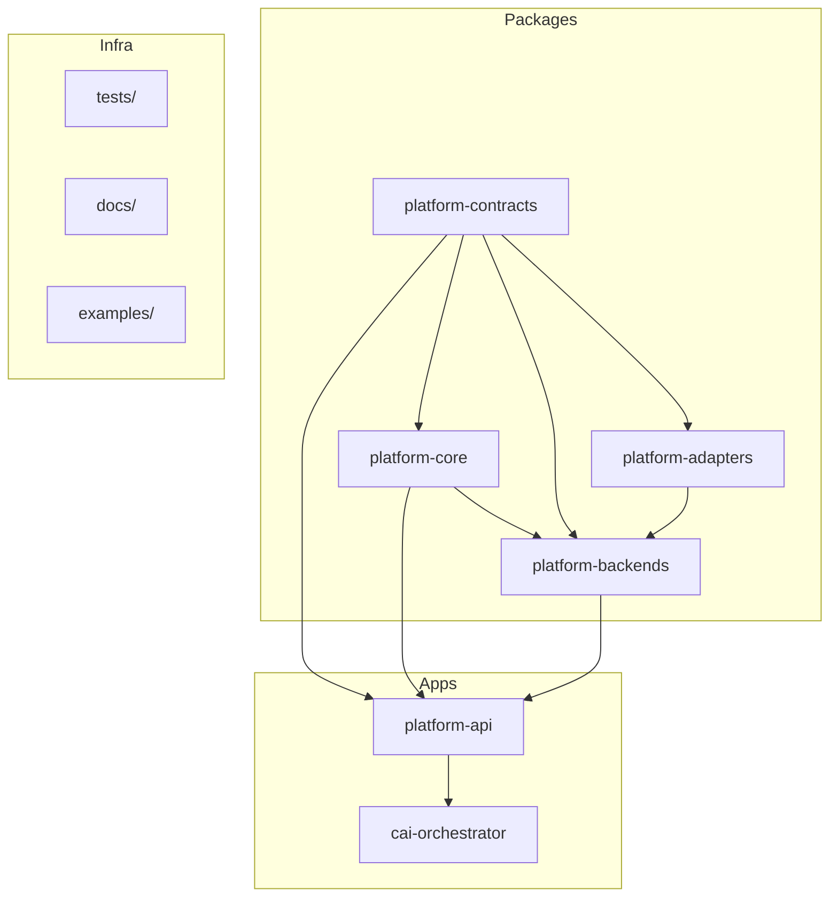

# Mapa del repositorio cai-platform (referencia experta)

Este documento consolida la estructura, boundaries, stack y flujos del repositorio para actuar como referencia en cambios y nuevas features.

## 1. Visión general

**cai-platform** es la plataforma v2 de investigación. Es un monorepo **solo Python** (sin workspaces npm), con contratos explícitos y boundaries por paquete. CAI es dependencia externa y solo aparece en `apps/cai-orchestrator/`.

- **Fuente de verdad:** [docs/README.md](../README.md).
- **Operaciones y bootstrap:** [docs/operations/README.md](../operations/README.md).

---

## 2. Estructura del repositorio

| Área | Ubicación | Rol |
|------|-----------|-----|
| **Contratos** | `packages/platform-contracts/` | Schemas Pydantic compartidos: cases, artifacts, runs, observations, backends, queries, approvals. Vocabulario canónico. |
| **Core** | `packages/platform-core/` | Puertos y servicios orquestación-neutral (cases, runs, artifacts, queries, approvals, audit). Sin vendor ni transporte. |
| **Adapters** | `packages/platform-adapters/` | Traducción de entradas WatchGuard y phishing a formas consumidas por backends. |
| **Backends** | `packages/platform-backends/` | Implementaciones deterministas: `watchguard_logs` (4 observaciones + query guardada) y `phishing_email` (basic_assessment). |
| **API** | `apps/platform-api/` | API HTTP FastAPI; único servicio en Docker/Compose. Runtime en memoria. |
| **Orquestador** | `apps/cai-orchestrator/` | CLI host-run que llama a platform-api; flujos WatchGuard/phishing y (opcional) CAI terminal. |
| **Tests** | `tests/` | Estructura por boundary: `contracts/`, `core/`, `adapters/`, `backends/`, `apps/`. `make test` → `pytest tests`. |
| **Docs** | `docs/` | architecture, contracts, backends, apps, adr, operations. |

---

## 3. Stack tecnológico

| Capa | Tecnología |
|------|------------|
| Lenguaje | Python 3.12+ |
| Empaquetado | setuptools, `pyproject.toml` por paquete (layout `src/`) |
| API HTTP | FastAPI, uvicorn |
| Cliente HTTP | httpx (cai-orchestrator) |
| Contratos | Pydantic 2 (platform-contracts) |
| Persistencia | Ninguna; estado en memoria en platform-api |
| Contenedores | Docker, Docker Compose (solo platform-api) |
| CAI (opcional) | cai-framework vía `apps/cai-orchestrator[cai]` |

**Intencionalmente ausente:** base de datos, colas, S3, AWS CLI obligatorio, MCP obligatorio, CAI obligatorio.

---

## 4. Puntos de entrada y rutas

### platform-api

- **Entrada:** `apps/platform-api/src/platform_api/app.py` → `create_app()`, `main()` (uvicorn).
- **Runtime:** `apps/platform-api/src/platform_api/runtime/wiring.py` → `create_runtime()` llama a `build_default_runtime()` en `runtime/memory.py`, que registra `watchguard_logs` y `phishing_email` en `InProcessBackendRegistry` y usa repos en memoria (cases, artifacts, runs) y `DevelopmentApprovalPolicy` + `InMemoryAuditPort`. `AppRuntime.execute_observation()` centraliza el despacho de ejecución a backends; las rutas no llaman backends directamente.
- **Rutas:** `apps/platform-api/src/platform_api/routes/` — health, cases, runs, queries, artifacts. Incluyen observaciones WatchGuard (ingest-workspace-zip, normalize, filter-denied, analytics-basic, top-talkers-basic), phishing (phishing-email-basic-assessment) y query guardada (watchguard-guarded-filtered-rows).

### cai-orchestrator

- **Entrada:** `apps/cai-orchestrator/src/cai_orchestrator/app.py` → `run_cli()`, `main()`.
- **Cliente:** `PlatformApiClient` en `cai_orchestrator/client` contra `PLATFORM_API_BASE_URL`.
- **Comandos CLI:** `run-watchguard`, `run-watchguard-filter-denied`, `run-watchguard-analytics-basic`, `run-watchguard-top-talkers-basic`, `run-watchguard-guarded-query`, `run-phishing-email-basic-assessment`, `run-cai-terminal`, `get-run-status`, `list-run-artifacts`, `read-artifact-content`. La ingesta de workspace ZIP (`watchguard-ingest-workspace-zip`) se expone sólo como tool del terminal CAI, no como subcomando CLI independiente.
- **Flujos:** `cai_orchestrator/flows` — cada flujo usa el client para crear case → artifact → run → ejecutar observación/query → devolver resultado.

---

## 5. Flujo de datos (resumen)

1. **Orquestador → API:** cai-orchestrator usa `PlatformApiClient` contra `PLATFORM_API_BASE_URL`.
2. **API → runtime:** Las rutas obtienen `get_runtime(request)`; el `AppRuntime` expone repos, `backend_registry` y el método `execute_observation()`. Las rutas pasan `backend_id` y `operation_kind` como strings; `execute_observation()` despacha al ejecutor correcto sin que las rutas conozcan las funciones de backend directamente.
3. **Backends:** Descriptores en `platform_backends.watchguard_logs` y `platform_backends.phishing_email`; ejecutores registrados en `AppRuntime`; ejecución en proceso.

---

## 6. Configuración y operación

| Archivo | Propósito |
|---------|-----------|
| `.env.example` | Referencia: `PLATFORM_API_BASE_URL`, `CAI_AGENT_TYPE`, `CAI_MODEL`. No se auto-cargan. |
| `compose.yml` | Un solo servicio `platform-api`; puerto `${PLATFORM_API_PORT:-8000}:8000`. |
| `Makefile` | `install-dev`, `build`, `up`, `down`, `test`, `test-apps`, `api-dev`, `health`, `demo-watchguard`, `demo-phishing-email`. |
| `apps/platform-api/Dockerfile` | Python 3.12-slim; instala packages + app; CMD `platform-api`. |

**Bootstrap mínimo (smoke test):** venv → `pip install -e apps/cai-orchestrator` → `make build && make up && make health` → demos con `examples/watchguard/minimal_payload.json` y `examples/phishing/minimal_payload.json`.

---

## 7. Contratos (platform-contracts) — módulos

- `common`: refs, base, enums.
- `cases`, `artifacts`, `runs`, `observations`, `investigations`, `queries`, `backends`, `approvals`: modelos por dominio.

Todo el resto del repo depende de estos tipos; son el vocabulario estable.

---

## 8. Backends (platform-backends) — estructura por backend

Cada backend tiene:

- `descriptor.py`: descriptor para el registry (observaciones y query guardada si aplica).
- `models.py`: tipos específicos del backend.
- `execute.py`: lógica de ejecución de observaciones/queries.
- `errors.py`: errores específicos.

**watchguard_logs:** workspace_zip_ingestion, normalize_and_summarize, filter_denied_events, analytics_bundle_basic, top_talkers_basic, guarded_filtered_rows (query guardada).
**phishing_email:** basic_assessment.

---

## 9. Tests

- `tests/contracts/`: tests de modelos y superficie del paquete contracts.
- `tests/core/`: cases, runs, observations, approvals, audit, boundaries.
- `tests/adapters/`: boundaries, watchguard_normalize, phishing_email_normalize.
- `tests/backends/`: boundaries, watchguard_logs_backend, phishing_email_backend.
- `tests/apps/`: runtime_baseline, boundaries, platform_api, cai_orchestrator, phishing flows, cai_terminal_integration.

Ejecución: `make test` (todo) o `make test-apps` (solo apps).

---

## 10. Convenciones

- Código en **`src/<package_name>/`** dentro de cada package/app.
- Tests en raíz en **`tests/`**, espejando boundaries (contracts, core, adapters, backends, apps).
- Package READMEs resumen boundaries y “must not own”; la documentación canónica está en `docs/`.
- No hay CI/CD ni linter/format config explícitos en el repo actual.

Con este mapa se puede localizar rápidamente dónde viven contratos, rutas, runtime, backends, flujos del orquestador y cómo encajan para cualquier cambio o nueva feature.
