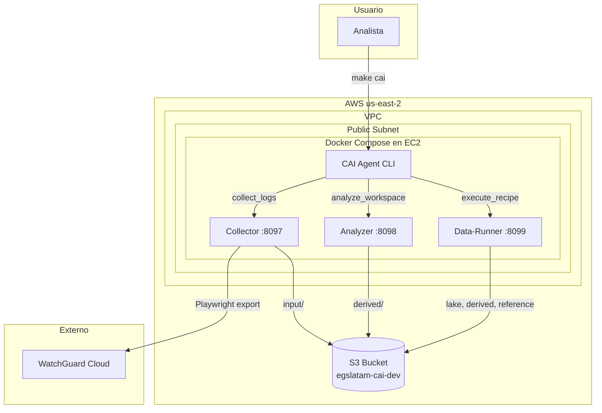

event
```csv
2025-10-23T09:26:52,FWStatus,ev,FW_PL1_CL_PRI,FW_XTM_PRI,loggerd,\N,10976070,3D01-0003,Archived log file /var/log/traffic.log which reached max size,,,,,,
2025-10-23T09:26:54,FWStatus,ev,FW_PL1_CL_PRI,FW_XTM_PRI,loggerd,\N,10976507,3D01-0003,Archived log file /var/log/diagnostic.log which reached max size,,,,,,
2025-10-23T09:26:57,FWStatus,ev,FW_PL1_CL_PRI,FW_XTM_PRI,loggerd,\N,10977988,3D01-0003,Archived log file /var/log/traffic.log which reached max size,,,,,,
2025-10-23T09:26:59,FWStatus,ev,FW_PL1_CL_PRI,FW_XTM_PRI,loggerd,\N,10978606,3D01-0003,Archived log file /var/log/diagnostic.log which reached max size,,,,,,
2025-10-23T09:27:02,FWStatus,ev,FW_PL1_CL_PRI,FW_XTM_PRI,loggerd,\N,10979883,3D01-0003,Archived log file /var/log/traffic.log which reached max size,,,,,,
2025-10-23T09:27:05,FWStatus,ev,FW_PL1_CL_PRI,FW_XTM_PRI,loggerd,\N,10980779,3D01-0003,Archived log file /var/log/diagnostic.log which reached max size,,,,,,
2025-10-23T09:27:08,FWStatus,ev,FW_PL1_CL_PRI,FW_XTM_PRI,loggerd,\N,10981779,3D01-0003,Archived log file /var/log/traffic.log which reached max size,,,,,,
2025-10-23T09:27:09,FWStatus,ev,FW_PL1_CL_PRI,FW_XTM_PRI,loggerd,\N,10982167,3D01-0003,Archived log file /var/log/trace/iked.log which reached max size,,,,,,
2025-10-23T09:27:11,FWStatus,ev,FW_PL1_CL_PRI,FW_XTM_PRI,loggerd,\N,10982783,3D01-0003,Archived log file /var/log/diagnostic.log which reached max size,,,,,,
2025-10-23T09:27:13,FWStatus,ev,FW_PL1_CL_PRI,FW_XTM_PRI,loggerd,\N,10983655,3D01-0003,Archived log file /var/log/traffic.log which reached max size,,,,,,
2025-10-23T09:27:15,FWStatus,ev,FW_PL1_CL_PRI,FW_XTM_PRI,loggerd,\N,10984491,3D01-0003,Archived log file /var/log/diagnostic.log which reached max size,,,,,,
```

alarm
```csv
2025-10-22T09:00:03,Notify,al,FW_PL1_CL_PRI,FW_XTM_PRI,firewall,6,\N,39632546,3000-0155,udp_flood_dos,email,Wed Oct 22 06:00:03 2025 (-03),UDP flood attack against 8.8.8.8 from 172.26.25.56 detected. 0 UDP flood packets dropped since last alarm.
2025-10-22T09:00:04,Notify,al,FW_PL1_CL_PRI,FW_XTM_PRI,firewall,6,\N,39632640,3000-0155,udp_flood_dos,email,Wed Oct 22 06:00:04 2025 (-03),UDP flood attack against 8.8.8.8 from 172.26.25.65 detected. 0 UDP flood packets dropped since last alarm.
2025-10-22T09:00:15,Notify,al,FW_PL1_CL_PRI,FW_XTM_PRI,firewall,6,\N,39639321,3000-0168,Block-Site-Notif,email,Wed Oct 22 06:00:15 2025 (-03),Blocked site: Traffic detected from 192.168.45.120 to 54.189.163.189.
2025-10-22T09:00:15,Notify,al,FW_PL1_CL_PRI,FW_XTM_PRI,firewall,6,\N,39638975,3000-0161,ddos_attack_src_dos,email,Wed Oct 22 06:00:15 2025 (-03),DDOS from client 10.0.12.12 detected.
2025-10-22T09:00:57,Notify,al,FW_PL1_CL_PRI,FW_XTM_PRI,firewall,6,\N,39661229,3000-0155,udp_flood_dos,email,Wed Oct 22 06:00:57 2025 (-03),UDP flood attack against 10.0.105.1 from 10.0.12.12 detected. 0 UDP flood packets dropped since last alarm.
2025-10-22T09:01:15,Notify,al,FW_PL1_CL_PRI,FW_XTM_PRI,firewall,6,\N,39671150,3000-0161,ddos_attack_src_dos,email,Wed Oct 22 06:01:15 2025 (-03),DDOS from client 10.0.12.12 detected.
2025-10-22T09:01:15,Notify,al,FW_PL1_CL_PRI,FW_XTM_PRI,firewall,6,\N,39671080,3000-0168,Block-Site-Notif,email,Wed Oct 22 06:01:15 2025 (-03),Blocked site: Traffic detected from 172.20.20.67 to 54.189.163.189.
2025-10-22T09:02:13,Notify,al,FW_PL1_CL_PRI,FW_XTM_PRI,firewall,6,\N,39701761,3000-0158,ip_scan_dos,email,Wed Oct 22 06:02:13 2025 (-03),IP scan attack against 190.171.167.155 from 36.68.34.170 detected.
2025-10-22T09:02:15,Notify,al,FW_PL1_CL_PRI,FW_XTM_PRI,firewall,6,\N,39702925,3000-0168,Block-Site-Notif,email,Wed Oct 22 06:02:15 2025 (-03),Blocked site: Traffic detected from 172.20.20.141 to 54.189.163.189.
2025-10-22T09:02:34,Notify,al,FW_PL1_CL_PRI,FW_XTM_PRI,firewall,6,\N,39711673,3000-0161,ddos_attack_src_dos,email,Wed Oct 22 06:02:34 2025 (-03),DDOS from client 10.212.199.60 detected.
2025-10-22T09:02:48,Notify,al,FW_PL1_CL_PRI,FW_XTM_PRI,firewall,6,\N,39718329,3000-0158,ip_scan_dos,email,Wed Oct 22 06:02:48 2025 (-03),IP scan attack against 190.171.167.146 from 190.205.151.32 detected.
2025-10-22T09:03:15,Notify,al,FW_PL1_CL_PRI,FW_XTM_PRI,firewall,6,\N,39731533,3000-0168,Block-Site-Notif,email,Wed Oct 22 06:03:15 2025 (-03),Blocked site: Traffic detected from 192.168.150.86 to 54.245.108.186.
2025-10-22T09:06:25,Notify,al,FW_PL1_CL_PRI,FW_XTM_PRI,firewall,6,\N,39820047,3000-0158,ip_scan_dos,email,Wed Oct 22 06:06:25 2025 (-03),IP scan attack against 190.208.2.235 from 202.162.205.249 detected.
2025-10-22T09:06:39,Notify,al,FW_PL1_CL_PRI,FW_XTM_PRI,firewall,6,\N,39826535,3000-0155,udp_flood_dos,email,Wed Oct 22 06:06:39 2025 (-03),UDP flood attack against 10.0.105.1 from 10.0.12.12 detected. 0 UDP flood packets dropped since last alarm.
2025-10-22T09:06:39,Notify,al,FW_PL1_CL_PRI,FW_XTM_PRI,firewall,6,\N,39826547,3000-0155,udp_flood_dos,email,Wed Oct 22 06:06:39 2025 (-03),UDP flood attack against 118.26.105.126 from 172.23.50.184 detected. 0 UDP flood packets dropped since last alarm.
2025-10-22T09:06:40,Notify,al,FW_PL1_CL_PRI,FW_XTM_PRI,firewall,6,\N,39826603,3000-0155,udp_flood_dos,email,Wed Oct 22 06:06:40 2025 (-03),UDP flood attack against 118.26.105.145 from 172.25.50.112 detected. 0 UDP flood packets dropped since last alarm.
2025-10-22T09:08:16,Notify,al,FW_PL1_CL_PRI,FW_XTM_PRI,firewall,6,\N,39872337,3000-0161,ddos_attack_src_dos,email,Wed Oct 22 06:08:16 2025 (-03),DDOS from client 10.30.0.58 detected.
2025-10-22T09:09:13,Notify,al,FW_PL1_CL_PRI,FW_XTM_PRI,firewall,6,\N,39899293,3000-0161,ddos_attack_src_dos,email,Wed Oct 22 06:09:13 2025 (-03),DDOS from client 10.0.12.12 detected.
2025-10-22T09:09:15,Notify,al,FW_PL1_CL_PRI,FW_XTM_PRI,firewall,6,\N,39900470,3000-0168,Block-Site-Notif,email,Wed Oct 22 06:09:15 2025 (-03),Blocked site: Traffic detected from 172.10.10.35 to 54.189.163.189.
2025-10-22T09:10:13,Notify,al,FW_PL1_CL_PRI,FW_XTM_PRI,firewall,6,\N,39928402,3000-0161,ddos_attack_src_dos,email,Wed Oct 22 06:10:13 2025 (-03),DDOS from client 10.0.12.12 detected.
2025-10-22T09:10:15,Notify,al,FW_PL1_CL_PRI,FW_XTM_PRI,firewall,6,\N,39929271,3000-0168,Block-Site-Notif,email,Wed Oct 22 06:10:15 2025 (-03),Blocked site: Traffic detected from 192.168.151.195 to 54.189.163.189.
2025-10-22T09:11:15,Notify,al,FW_PL1_CL_PRI,FW_XTM_PRI,firewall,6,\N,39958685,3000-0168,Block-Site-Notif,email,Wed Oct 22 06:11:15 2025 (-03),Blocked site: Traffic detected from 172.24.10.122 to 54.189.163.189.
2025-10-22T09:11:38,Notify,al,FW_PL1_CL_PRI,FW_XTM_PRI,firewall,6,\N,39969717,3000-0161,ddos_attack_src_dos,email,Wed Oct 22 06:11:38 2025 (-03),DDOS from client 10.0.12.12 detected.
2025-10-22T09:12:13,Notify,al,FW_PL1_CL_PRI,FW_XTM_PRI,firewall,6,\N,39986428,3000-0161,ddos_attack_src_dos,email,Wed Oct 22 06:12:13 2025 (-03),DDOS from client 10.0.12.12 detected.
2025-10-22T09:12:15,Notify,al,FW_PL1_CL_PRI,FW_XTM_PRI,firewall,6,\N,39987392,3000-0168,Block-Site-Notif,email,Wed Oct 22 06:12:15 2025 (-03),Blocked site: Traffic detected from 192.168.45.123 to 54.189.163.189.
2025-10-22T09:12:16,Notify,al,FW_PL1_CL_PRI,FW_XTM_PRI,firewall,6,\N,39987624,3000-0155,udp_flood_dos,email,Wed Oct 22 06:12:16 2025 (-03),UDP flood attack against 8.8.8.8 from 172.26.25.65 detected. 0 UDP flood packets dropped since last alarm.
2025-10-22T09:12:16,Notify,al,FW_PL1_CL_PRI,FW_XTM_PRI,firewall,6,\N,39987697,3000-0155,udp_flood_dos,email,Wed Oct 22 06:12:16 2025 (-03),UDP flood attack against 8.8.8.8 from 172.26.25.56 detected. 0 UDP flood packets dropped since last alarm.
2025-10-22T09:12:26,Notify,al,FW_PL1_CL_PRI,FW_XTM_PRI,firewall,6,\N,39992540,3000-0155,udp_flood_dos,email,Wed Oct 22 06:12:26 2025 (-03),UDP flood attack against 118.26.105.138 from 172.24.50.28 detected. 0 UDP flood packets dropped since last alarm.
2025-10-22T09:13:13,Notify,al,FW_PL1_CL_PRI,FW_XTM_PRI,firewall,6,\N,40013821,3000-0161,ddos_attack_src_dos,email,Wed Oct 22 06:13:13 2025 (-03),DDOS from client 10.0.12.12 detected.
2025-10-22T09:13:15,Notify,al,FW_PL1_CL_PRI,FW_XTM_PRI,firewall,6,\N,40015040,3000-0168,Block-Site-Notif,email,Wed Oct 22 06:13:15 2025 (-03),Blocked site: Traffic detected from 10.30.2.114 to 54.189.163.189.
2025-10-22T09:13:56,Notify,al,FW_PL1_CL_PRI,FW_XTM_PRI,firewall,6,\N,40034794,3000-0155,udp_flood_dos,email,Wed Oct 22 06:13:56 2025 (-03),UDP flood attack against 8.8.8.8 from 172.26.25.65 detected. 0 UDP flood packets dropped since last alarm.
2025-10-22T09:14:15,Notify,al,FW_PL1_CL_PRI,FW_XTM_PRI,firewall,6,\N,40043580,3000-0168,Block-Site-Notif,email,Wed Oct 22 06:14:15 2025 (-03),Blocked site: Traffic detected from 10.30.1.9 to 54.189.163.189.
2025-10-22T09:14:16,Notify,al,FW_PL1_CL_PRI,FW_XTM_PRI,firewall,6,\N,40043932,3000-0161,ddos_attack_src_dos,email,Wed Oct 22 06:14:16 2025 (-03),DDOS from client 10.30.0.58 detected.
2025-10-22T09:14:30,Notify,al,FW_PL1_CL_PRI,FW_XTM_PRI,firewall,6,\N,40050776,3000-0155,udp_flood_dos,email,Wed Oct 22 06:14:30 2025 (-03),UDP flood attack against 192.168.130.1 from 10.2.2.2 detected. 0 UDP flood packets dropped since last alarm.
2025-10-22T09:15:15,Notify,al,FW_PL1_CL_PRI,FW_XTM_PRI,firewall,6,\N,40071473,3000-0168,Block-Site-Notif,email,Wed Oct 22 06:15:15 2025 (-03),Blocked site: Traffic detected from 192.168.242.63 to 54.245.108.186.
2025-10-22T09:15:16,Notify,al,FW_PL1_CL_PRI,FW_XTM_PRI,firewall,6,\N,40072015,3000-0155,udp_flood_dos,email,Wed Oct 22 06:15:16 2025 (-03),UDP flood attack against 8.8.8.8 from 172.26.25.56 detected. 0 UDP flood packets dropped since last alarm.
2025-10-22T09:15:25,Notify,al,FW_PL1_CL_PRI,FW_XTM_PRI,firewall,6,\N,40076124,3000-0161,ddos_attack_src_dos,email,Wed Oct 22 06:15:25 2025 (-03),DDOS from client 10.0.12.12 detected.
2025-10-22T09:16:15,Notify,al,FW_PL1_CL_PRI,FW_XTM_PRI,firewall,6,\N,40099066,3000-0161,ddos_attack_src_dos,email,Wed Oct 22 06:16:15 2025 (-03),DDOS from client 10.0.12.12 detected.
2025-10-22T09:16:15,Notify,al,FW_PL1_CL_PRI,FW_XTM_PRI,firewall,6,\N,40099182,3000-0168,Block-Site-Notif,email,Wed Oct 22 06:16:15 2025 (-03),Blocked site: Traffic detected from 172.20.20.154 to 54.189.163.189.
2025-10-22T09:16:48,Notify,al,FW_PL1_CL_PRI,FW_XTM_PRI,firewall,6,\N,40113709,3000-0158,ip_scan_dos,email,Wed Oct 22 06:16:48 2025 (-03),IP scan attack against 190.171.167.157 from 58.211.239.142 detected.
2025-10-22T09:17:15,Notify,al,FW_PL1_CL_PRI,FW_XTM_PRI,firewall,6,\N,40126256,3000-0168,Block-Site-Notif,email,Wed Oct 22 06:17:15 2025 (-03),Blocked site: Traffic detected from 87.120.191.84 to 190.208.2.238.
2025-10-22T09:17:15,Notify,al,FW_PL1_CL_PRI,FW_XTM_PRI,firewall,6,\N,40126144,3000-0161,ddos_attack_src_dos,email,Wed Oct 22 06:17:15 2025 (-03),DDOS from client 172.24.200.24 detected.
2025-10-22T09:18:15,Notify,al,FW_PL1_CL_PRI,FW_XTM_PRI,firewall,6,\N,40156181,3000-0168,Block-Site-Notif,email,Wed Oct 22 06:18:15 2025 (-03),Blocked site: Traffic detected from 192.168.151.214 to 54.245.108.186.
2025-10-22T09:18:16,Notify,al,FW_PL1_CL_PRI,FW_XTM_PRI,firewall,6,\N,40156728,3000-0161,ddos_attack_src_dos,email,Wed Oct 22 06:18:16 2025 (-03),DDOS from client 10.30.0.58 detected.
2025-10-22T09:19:15,Notify,al,FW_PL1_CL_PRI,FW_XTM_PRI,firewall,6,\N,40185212,3000-0168,Block-Site-Notif,email,Wed Oct 22 06:19:15 2025 (-03),Blocked site: Traffic detected from 192.168.48.115 to 54.189.163.189.
2025-10-22T09:19:23,Notify,al,FW_PL1_CL_PRI,FW_XTM_PRI,firewall,6,\N,40189126,3000-0155,udp_flood_dos,email,Wed Oct 22 06:19:23 2025 (-03),UDP flood attack against 118.26.105.138 from 172.25.50.113 detected. 0 UDP flood packets dropped since last alarm.
2025-10-22T09:19:23,Notify,al,FW_PL1_CL_PRI,FW_XTM_PRI,firewall,6,\N,40189159,3000-0155,udp_flood_dos,email,Wed Oct 22 06:19:23 2025 (-03),UDP flood attack against 8.8.8.8 from 172.26.25.56 detected. 0 UDP flood packets dropped since last alarm.
2025-10-22T09:19:24,Notify,al,FW_PL1_CL_PRI,FW_XTM_PRI,firewall,6,\N,40189163,3000-0155,udp_flood_dos,email,Wed Oct 22 06:19:24 2025 (-03),UDP flood attack against 8.8.8.8 from 172.26.25.64 detected. 0 UDP flood packets dropped since last alarm.
2025-10-22T09:21:23,Notify,al,FW_PL1_CL_PRI,FW_XTM_PRI,firewall,6,\N,40244703,3000-0155,udp_flood_dos,email,Wed Oct 22 06:21:23 2025 (-03),UDP flood attack against 8.8.8.8 from 172.26.25.65 detected. 0 UDP flood packets dropped since last alarm.
2025-10-22T09:23:20,Notify,al,FW_PL1_CL_PRI,FW_XTM_PRI,firewall,6,\N,40272589,3000-0158,ip_scan_dos,email,Wed Oct 22 06:23:20 2025 (-03),IP scan attack against 190.13.160.66 from 182.9.34.10 detected.
2025-10-22T09:23:22,Notify,al,FW_PL1_CL_PRI,FW_XTM_PRI,firewall,6,\N,40273602,3000-0161,ddos_attack_src_dos,email,Wed Oct 22 06:23:22 2025 (-03),DDOS from client 10.0.12.12 detected.
2025-10-22T09:24:28,Notify,al,FW_PL1_CL_PRI,FW_XTM_PRI,firewall,6,\N,40304026,3000-0161,ddos_attack_src_dos,email,Wed Oct 22 06:24:28 2025 (-03),DDOS from client 10.212.199.60 detected.
2025-10-22T09:25:15,Notify,al,FW_PL1_CL_PRI,FW_XTM_PRI,firewall,6,\N,40326144,3000-0168,Block-Site-Notif,email,Wed Oct 22 06:25:15 2025 (-03),Blocked site: Traffic detected from 10.30.2.76 to 54.189.163.189.
2025-10-22T09:25:25,Notify,al,FW_PL1_CL_PRI,FW_XTM_PRI,firewall,6,\N,40330924,3000-0161,ddos_attack_src_dos,email,Wed Oct 22 06:25:25 2025 (-03),DDOS from client 10.0.12.12 detected.
2025-10-22T09:26:05,Notify,al,FW_PL1_CL_PRI,FW_XTM_PRI,firewall,6,\N,40349072,3000-0158,ip_scan_dos,email,Wed Oct 22 06:26:05 2025 (-03),IP scan attack against 190.13.160.73 from 172.105.158.232 detected.
2025-10-22T09:26:05,Notify,al,FW_PL1_CL_PRI,FW_XTM_PRI,firewall,6,\N,40349073,3000-0158,ip_scan_dos,email,Wed Oct 22 06:26:05 2025 (-03),IP scan attack against 190.13.160.76 from 172.105.158.232 detected.
2025-10-22T09:26:15,Notify,al,FW_PL1_CL_PRI,FW_XTM_PRI,firewall,6,\N,40353905,3000-0168,Block-Site-Notif,email,Wed Oct 22 06:26:15 2025 (-03),Blocked site: Traffic detected from 172.24.10.145 to 54.245.108.186.
2025-10-22T09:26:17,Notify,al,FW_PL1_CL_PRI,FW_XTM_PRI,firewall,6,\N,40354528,3000-0161,ddos_attack_src_dos,email,Wed Oct 22 06:26:17 2025 (-03),DDOS from client 10.30.0.58 detected.
2025-10-22T09:27:13,Notify,al,FW_PL1_CL_PRI,FW_XTM_PRI,firewall,6,\N,40380723,3000-0161,ddos_attack_src_dos,email,Wed Oct 22 06:27:13 2025 (-03),DDOS from client 10.0.12.12 detected.
2025-10-22T09:27:15,Notify,al,FW_PL1_CL_PRI,FW_XTM_PRI,firewall,6,\N,40381555,3000-0168,Block-Site-Notif,email,Wed Oct 22 06:27:15 2025 (-03),Blocked site: Traffic detected from 192.168.10.23 to 54.245.108.186.
2025-10-22T09:28:01,Notify,al,FW_PL1_CL_PRI,FW_XTM_PRI,firewall,6,\N,40402287,3000-0155,udp_flood_dos,email,Wed Oct 22 06:28:01 2025 (-03),UDP flood attack against 192.168.1.111 from 172.24.50.49 detected. 0 UDP flood packets dropped since last alarm.
2025-10-22T09:28:15,Notify,al,FW_PL1_CL_PRI,FW_XTM_PRI,firewall,6,\N,40409211,3000-0168,Block-Site-Notif,email,Wed Oct 22 06:28:15 2025 (-03),Blocked site: Traffic detected from 172.23.40.53 to 54.189.163.189.
2025-10-22T09:28:17,Notify,al,FW_PL1_CL_PRI,FW_XTM_PRI,firewall,6,\N,40409930,3000-0161,ddos_attack_src_dos,email,Wed Oct 22 06:28:17 2025 (-03),DDOS from client 10.30.0.58 detected.
2025-10-22T09:29:15,Notify,al,FW_PL1_CL_PRI,FW_XTM_PRI,firewall,6,\N,40437337,3000-0168,Block-Site-Notif,email,Wed Oct 22 06:29:15 2025 (-03),Blocked site: Traffic detected from 192.168.12.163 to 54.189.163.189.
2025-10-22T09:29:18,Notify,al,FW_PL1_CL_PRI,FW_XTM_PRI,firewall,6,\N,40438649,3000-0161,ddos_attack_src_dos,email,Wed Oct 22 06:29:18 2025 (-03),DDOS from client 10.0.12.12 detected.
2025-10-22T09:29:41,Notify,al,FW_PL1_CL_PRI,FW_XTM_PRI,firewall,6,\N,40449335,3000-0155,udp_flood_dos,email,Wed Oct 22 06:29:41 2025 (-03),UDP flood attack against 10.22.5.254 from 172.23.50.199 detected. 0 UDP flood packets dropped since last alarm.
2025-10-22T09:30:15,Notify,al,FW_PL1_CL_PRI,FW_XTM_PRI,firewall,6,\N,40466894,3000-0168,Block-Site-Notif,email,Wed Oct 22 06:30:15 2025 (-03),Blocked site: Traffic detected from 10.30.0.10 to 54.245.108.186.
2025-10-22T09:30:17,Notify,al,FW_PL1_CL_PRI,FW_XTM_PRI,firewall,6,\N,40467630,3000-0161,ddos_attack_src_dos,email,Wed Oct 22 06:30:17 2025 (-03),DDOS from client 10.30.0.58 detected.
2025-10-22T09:30:49,Notify,al,FW_PL1_CL_PRI,FW_XTM_PRI,firewall,6,\N,40481725,3000-0158,ip_scan_dos,email,Wed Oct 22 06:30:49 2025 (-03),IP scan attack against 190.13.160.78 from 90.151.171.106 detected.
2025-10-22T09:31:13,Notify,al,FW_PL1_CL_PRI,FW_XTM_PRI,firewall,6,\N,40492995,3000-0161,ddos_attack_src_dos,email,Wed Oct 22 06:31:13 2025 (-03),DDOS from client 10.0.12.12 detected.
2025-10-22T09:31:15,Notify,al,FW_PL1_CL_PRI,FW_XTM_PRI,firewall,6,\N,40494003,3000-0168,Block-Site-Notif,email,Wed Oct 22 06:31:15 2025 (-03),Blocked site: Traffic detected from 192.168.244.15 to 54.189.163.189.
2025-10-22T09:32:13,Notify,al,FW_PL1_CL_PRI,FW_XTM_PRI,firewall,6,\N,40520768,3000-0161,ddos_attack_src_dos,email,Wed Oct 22 06:32:13 2025 (-03),DDOS from client 10.0.12.12 detected.
2025-10-22T09:32:15,Notify,al,FW_PL1_CL_PRI,FW_XTM_PRI,firewall,6,\N,40521752,3000-0168,Block-Site-Notif,email,Wed Oct 22 06:32:15 2025 (-03),Blocked site: Traffic detected from 192.168.12.154 to 54.245.108.186.
2025-10-22T09:32:18,Notify,al,FW_PL1_CL_PRI,FW_XTM_PRI,firewall,6,\N,40523249,3000-0155,udp_flood_dos,email,Wed Oct 22 06:32:18 2025 (-03),UDP flood attack against 8.8.8.8 from 172.26.25.56 detected. 0 UDP flood packets dropped since last alarm.
2025-10-22T09:32:18,Notify,al,FW_PL1_CL_PRI,FW_XTM_PRI,firewall,6,\N,40523236,3000-0155,udp_flood_dos,email,Wed Oct 22 06:32:18 2025 (-03),UDP flood attack against 118.26.105.145 from 10.14.50.93 detected. 0 UDP flood packets dropped since last alarm.
2025-10-22T09:32:18,Notify,al,FW_PL1_CL_PRI,FW_XTM_PRI,firewall,6,\N,40523189,3000-0155,udp_flood_dos,email,Wed Oct 22 06:32:18 2025 (-03),UDP flood attack against 118.26.105.123 from 172.30.100.21 detected. 0 UDP flood packets dropped since last alarm.
2025-10-22T09:32:37,Notify,al,FW_PL1_CL_PRI,FW_XTM_PRI,firewall,6,\N,40530979,3000-0169,spoofing_dos,email,Wed Oct 22 06:32:37 2025 (-03),IP spoofing: Traffic detected from 192.168.1.10 to 190.54.44.148.
2025-10-22T09:32:37,Notify,al,FW_PL1_CL_PRI,FW_XTM_PRI,firewall,6,\N,40530955,3000-0169,spoofing_dos,email,Wed Oct 22 06:32:37 2025 (-03),IP spoofing: Traffic detected from 192.168.1.10 to 190.54.44.148.
2025-10-22T09:33:15,Notify,al,FW_PL1_CL_PRI,FW_XTM_PRI,firewall,6,\N,40549022,3000-0168,Block-Site-Notif,email,Wed Oct 22 06:33:15 2025 (-03),Blocked site: Traffic detected from 192.168.200.23 to 54.189.163.189.
2025-10-22T09:33:23,Notify,al,FW_PL1_CL_PRI,FW_XTM_PRI,firewall,6,\N,40552611,3000-0155,udp_flood_dos,email,Wed Oct 22 06:33:23 2025 (-03),UDP flood attack against 10.0.105.1 from 10.0.12.12 detected. 0 UDP flood packets dropped since last alarm.
2025-10-22T09:33:27,Notify,al,FW_PL1_CL_PRI,FW_XTM_PRI,firewall,6,\N,40554404,3000-0161,ddos_attack_src_dos,email,Wed Oct 22 06:33:27 2025 (-03),DDOS from client 10.0.12.12 detected.
```

traffic
```csv
2025-10-22T09:02:37,FWAllow,FW_PL1_CL_PRI,39713382,3000-0148,Allow,SNAT_DNS_PUBLICOS_BCKP-00,,dns/udp,Claro DataCenter,DMZ-TRUNK,57.141.6.251,48465,190.54.44.149,53,,,,,,,,,,A,ns.pf.cl,,,,Allowed
2025-10-22T09:02:37,FWAllow,FW_PL1_CL_PRI,39713383,3000-0148,Allow,DNS - OUT-00,,dns/udp,Inter-red_PF1,Movistar Planta 1,172.26.25.64,55738,8.8.8.8,53,,,,,,,,,,A,devaccess.easy4ipcloud.com,,,,Allowed
2025-10-22T09:02:37,FWAllow,FW_PL1_CL_PRI,39713384,3000-0148,Allow,DNS - OUT-00,,dns/udp,Inter-red_PF1,Movistar Planta 1,172.26.25.64,55738,8.8.8.8,53,,,,,,,,,,AAAA,devaccess.easy4ipcloud.com,,,,Allowed
2025-10-22T09:02:37,FWAllow,FW_PL1_CL_PRI,39713385,3000-0149,Allow,SNAT_BALANCEADOR_CARGA_HTTPS_BCKP-00,,https/tcp,Movistar Datacenter,DMZ-TRUNK,185.94.143.64,38591,190.171.167.152,443,,,,,,,,,,,,,,,Application identified
2025-10-22T09:02:37,FWDeny,FW_PL1_CL_PRI,39713386,3000-0148,Deny,Unhandled Internal Packet-00,,28080/tcp,Inter-red_PF1,Movistar Planta 1,172.26.25.65,41864,47.85.92.246,28080,,,,,,,,,,,,,0,60,Denied
2025-10-22T09:02:37,FWAllow,FW_PL1_CL_PRI,39713387,3000-0148,Allow,SD-WAN MERAKI_PING-00,,echo-request/icmp,Inter-red_PF1,Claro DataCenter,10.10.200.68,\N,8.8.8.8,\N,,,,,,,,,,,,,,,Allowed
2025-10-22T09:02:37,FWAllow,FW_PL1_CL_PRI,39713388,3000-0148,Allow,SD-WAN MERAKI_PING-00,,echo-request/icmp,Inter-red_PF1,Claro DataCenter,10.20.200.67,\N,8.8.8.8,\N,,,,,,,,,,,,,,,Allowed
2025-10-22T09:02:37,FWAllowEnd,FW_PL1_CL_PRI,39713389,3000-0151,Allow,DNS - OUT-00,,dns/udp,Inter-red_PF1,Movistar Planta 1,172.26.25.65,36635,8.8.8.8,53,,,,,,,,,,,,,303,144,Allowed
2025-10-22T09:02:37,FWAllowEnd,FW_PL1_CL_PRI,39713390,3000-0151,Allow,Microsoft-00,,https/tcp,Inter-red_PF1,Movistar Planta 1,172.23.10.116,50706,204.79.197.203,443,,,,,,,,,,,,,7197,2801,Allowed
2025-10-22T09:02:37,FWAllowEnd,FW_PL1_CL_PRI,39713391,3000-0151,Allow,DNS - OUT-00,,dns/udp,Inter-red_PF1,Movistar Planta 1,192.168.200.105,57008,8.8.8.8,53,,,,,,,,,,,,,239,117,Allowed
2025-10-22T09:02:37,ProxyHTTPSReq,FW_PL1_CL_PRI,39713392,2CFF-0000,Allow,HTTPS-Bypass-Usuarios-00,HTTPS-Forcepoint,https/tcp,Inter-red_PF1,Movistar Planta 1,172.23.10.116,50664,52.182.143.215,443,,,,,,,browser.events.data.msn.com,,,,,,7046,3090,HTTPS Request
2025-10-22T09:02:37,FWAllowEnd,FW_PL1_CL_PRI,39713393,3000-0151,Allow,DNS - OUT-00,,dns/udp,Inter-red_PF1,Movistar Planta 1,192.168.10.22,62163,8.8.8.8,53,,,,,,,,,,,,,239,117,Allowed
2025-10-22T09:02:37,FWAllowEnd,FW_PL1_CL_PRI,39713394,3000-0151,Allow,DNS - OUT-00,,dns/udp,Inter-red_PF1,Movistar Planta 1,192.168.10.20,61774,8.8.8.8,53,,,,,,,,,,,,,452,161,Allowed
2025-10-22T09:02:37,FWAllowEnd,FW_PL1_CL_PRI,39713395,3000-0151,Allow,DNS - OUT-00,,dns/udp,Inter-red_PF1,Movistar Planta 1,172.26.25.65,40943,8.8.8.8,53,,,,,,,,,,,,,303,144,Allowed
2025-10-22T09:02:37,FWAllowEnd,FW_PL1_CL_PRI,39713396,3000-0151,Allow,DNS - OUT-00,,dns/udp,Inter-red_PF1,Movistar Planta 1,172.26.25.56,44953,8.8.8.8,53,,,,,,,,,,,,,303,144,Allowed
2025-10-22T09:02:37,FWAllowEnd,FW_PL1_CL_PRI,39713397,3000-0151,Allow,DNS - OUT-00,,dns/udp,Inter-red_PF1,Movistar Planta 1,192.168.10.20,61873,8.8.8.8,53,,,,,,,,,,,,,115,99,Allowed
2025-10-22T09:02:37,FWAllowEnd,FW_PL1_CL_PRI,39713398,3000-0151,Allow,DNS - OUT-00,,dns/udp,Inter-red_PF1,Movistar Planta 1,192.168.10.20,61989,8.8.8.8,53,,,,,,,,,,,,,109,72,Allowed
2025-10-22T09:02:37,FWAllowEnd,FW_PL1_CL_PRI,39713399,3000-0151,Allow,DNS - OUT-00,,dns/udp,Inter-red_PF1,Movistar Planta 1,172.26.25.64,60353,8.8.8.8,53,,,,,,,,,,,,,303,144,Allowed
2025-10-22T09:02:37,FWAllow,FW_PL1_CL_PRI,39713400,3000-0148,Allow,DNS - OUT-00,,dns/udp,Inter-red_PF1,Movistar Planta 1,172.26.25.65,51821,8.8.8.8,53,,,,,,,,,,A,devaccess.easy4ipcloud.com,,,,Allowed
2025-10-22T09:02:37,FWAllow,FW_PL1_CL_PRI,39713401,3000-0148,Allow,DNS - OUT-00,,dns/udp,Inter-red_PF1,Movistar Planta 1,172.26.25.65,51821,8.8.8.8,53,,,,,,,,,,AAAA,devaccess.easy4ipcloud.com,,,,Allowed
2025-10-22T09:02:37,FWAllow,FW_PL1_CL_PRI,39713402,3000-0148,Allow,DMZ IND_SCADA PL1_502 TCP-00,,502/tcp,DMZ-IND,Inter-red_PF1,192.168.242.50,63552,192.168.240.52,502,,,,,,,,,,,,,,,Allowed
2025-10-22T09:02:37,FWAllow,FW_PL1_CL_PRI,39713403,3000-0148,Allow,SNAT_DNS_PUBLICOS_BCKP-00,,dns/udp,Claro DataCenter,DMZ-TRUNK,172.253.237.28,40971,190.54.44.149,53,,,,,,,,,,AAAA,wwW.tIENdApfalIMEnTOS.CL,,,,Allowed
2025-10-22T09:02:37,FWAllow,FW_PL1_CL_PRI,39713404,3000-0148,Allow,Snat_NPM_RESP-00,,https/tcp,Movistar Planta 1,DMZ-TRUNK,191.37.226.22,45405,190.82.90.35,443,,,,,,,,,,,,,,,Allowed

```


# Diagrama arquitectónico CAI Project en AWS

  

## Diagrama (Mermaid)

  



  

## Estructura S3

  

```

s3://egslatam-cai-dev/

├── workspaces/{workspace}/

│   ├── input/uploads/{upload_id}/   ← ZIPs subidos

│   ├── lake/

│   │   ├── raw/                     ← Parquet crudo

│   │   └── normalized/              ← Parquet normalizado

│   └── derived/runs/{run_id}/

│       ├── analytics/               ← coverage, top_entities, timeseries, etc.

│       ├── mitre/                   ← mitre_mapping.json

│       └── drilldown/{drill_id}/    ← topk, timeseries, pivot, sample

└── reference/mitre/                 ← enterprise_techniques.json

```

  

## Flujo de datos

  

| Origen | Destino | Descripción |

|--------|---------|-------------|

| Analista | CAI | CLI conversacional |

| CAI | Collector | collect_logs (WQL) |

| CAI | Analyzer | analyze_workspace |

| CAI | Data-Runner | execute_recipe |

| Collector | WatchGuard Cloud | Login, export logs |

| Collector | S3 | Escribe input/ (modo S3) |

| Analyzer | S3 / runtime | Lee input, escribe derived |

| Data-Runner | S3 | Ingest, analytics, MITRE, drilldown |

  

## Componentes

  

| Servicio | Puerto | Rol |

|----------|--------|-----|

| CAI | - | Agente CLI, orquesta tools |

| Collector | 8097 | Automatiza WatchGuard Cloud (Playwright) |

| Analyzer | 8098 | Ingest, profiling, summary_llm |

| Data-Runner | 8099 | S3 data plane, recipes (ingest, analytics, MITRE, drilldown) |

  

---

  

## Diagrama con Eraser (opcional)

  

Para generar un diagrama con iconos AWS usando [Eraser](https://app.eraser.io), usa el DSL en `architecture-aws-diagram.eraser` o ejecuta:

  

```bash

export ERASER_API_KEY=tu_api_key

curl -X POST https://app.eraser.io/api/render/elements \

  -H "Content-Type: application/json" \

  -H "X-Skill-Source: cursor" \

  -H "Authorization: Bearer $ERASER_API_KEY" \

  -d '{

    "elements": [{

      "type": "diagram",

      "id": "diagram-1",

      "code": "VPC [label: \"VPC CAI Project\"] {\n  Subnet [label: \"Public Subnet\"] {\n    EC2 [icon: aws-ec2, label: \"EC2 Docker Host\"]\n  }\n}\nEC2 {\n  CAI [label: \"CAI Agent CLI\"]\n  Collector [label: \"Collector :8097\"]\n  Analyzer [label: \"Analyzer :8098\"]\n  DataRunner [label: \"Data-Runner :8099\"]\n}\nS3 [icon: aws-s3, label: \"S3 egslatam-cai-dev\"]\nWatchGuard [label: \"WatchGuard Cloud\"]\nUser [label: \"Analista\"]\nUser -> CAI\nCAI -> Collector\nCAI -> Analyzer\nCAI -> DataRunner\nCollector -> WatchGuard\nCollector -> S3\nAnalyzer -> S3\nDataRunner -> S3",

      "diagramType": "cloud-architecture-diagram"

    }],

    "scale": 2,

    "theme": "dark",

    "background": true

  }'

```